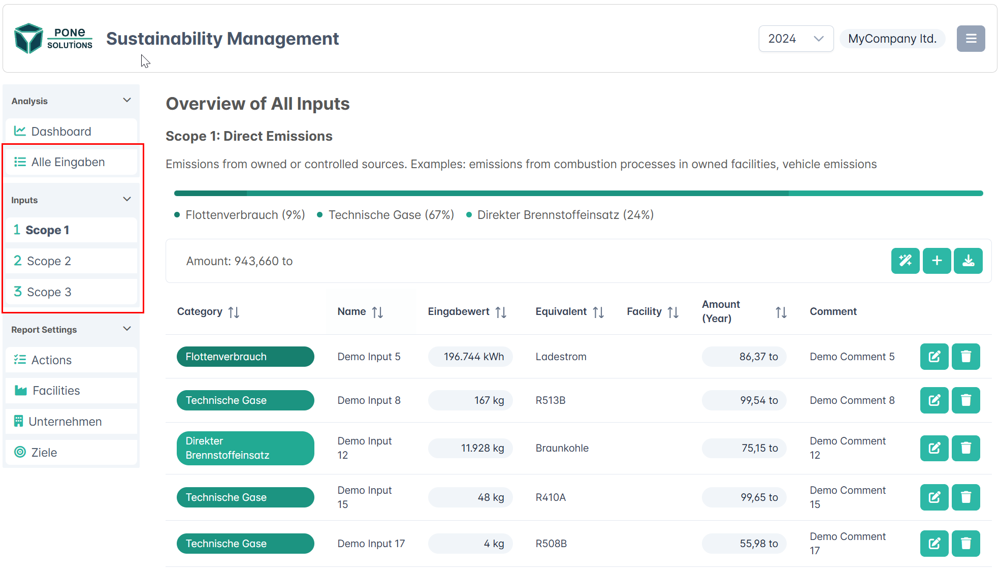
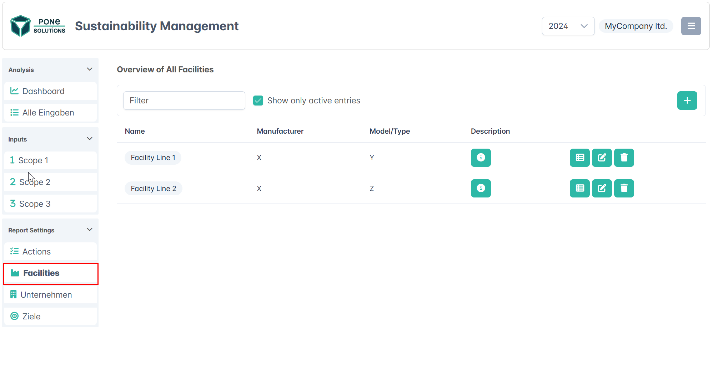
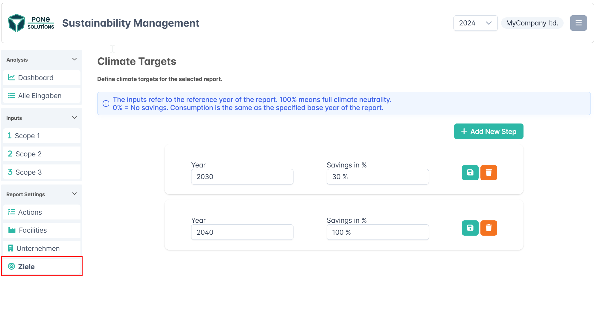
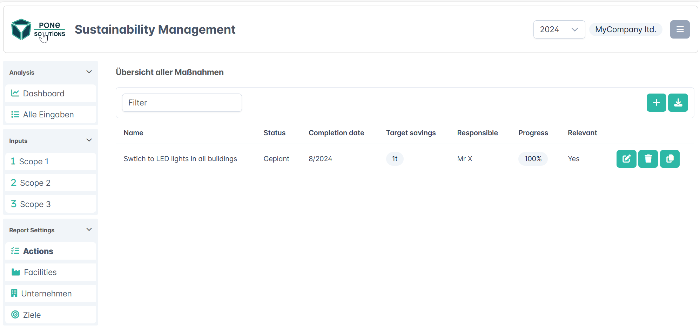
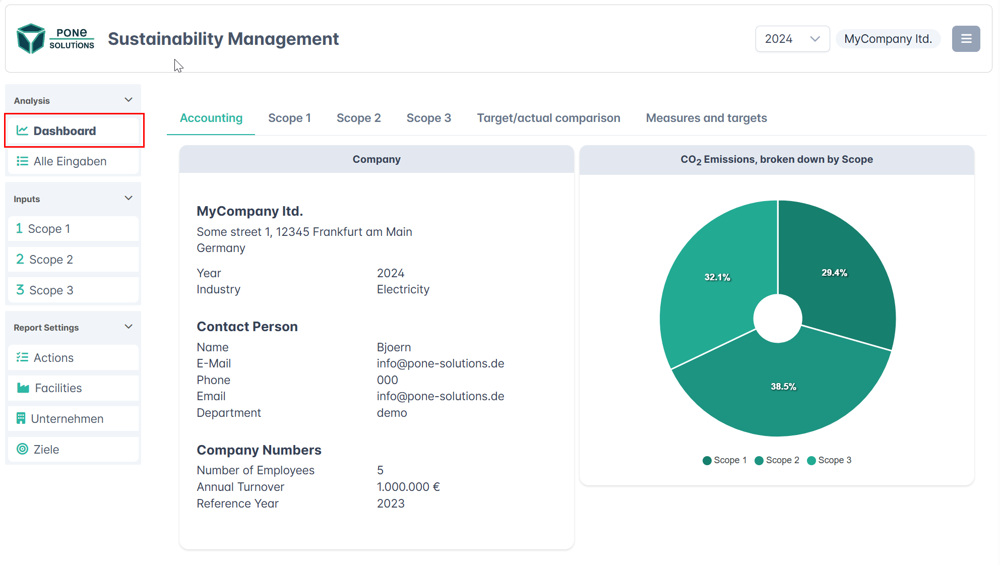
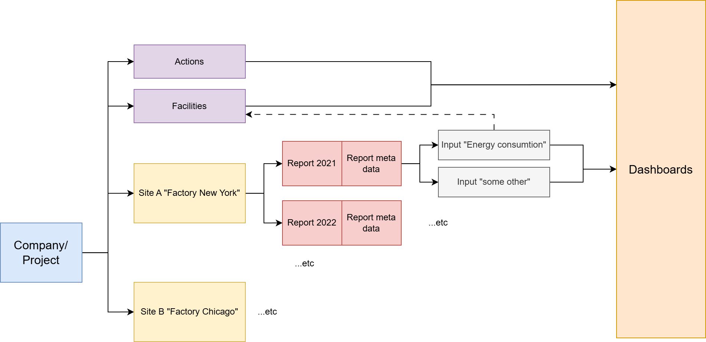

# Sustainability Manager developer docs

## App

The App sustainability manager is for small companies to build their CO2 footprint.
Therefore the user can add data in the App and can analyse it´s data with some dashboards.

The user get´s some basic structure in the App to have a better user experience.

## Use Cases

### Input CO2 data

The user will add his CO2 relevant inputs. That are Energy, Heating energy etc.

### Company Facilities

Each CO2 input can be assigned to a factories "facility" to have a better filtering later.

### Input companies goals

Each company has goals to reach CO2 neutrality (Zero carbon footprint).
The company can add his goals in yearly/percentage goals.

### Input Actions

To reach the companies goals and targets a company has to do some energy saving and CO2 saving actions. These actions can be "Install LED lights instead old lightening systems".

To track these actions a user can input "actions".

### Analysis and Dashobars

At the end the user can see and analyse his inputs in a dashboard based on yearly reports.

## Data structure

### Authentification

The Authentification is done via Auth0 and JWT.
The database is connected via the "PostgREST" service which will provice ORM like database access.
All permissions are controlled by Postgres Row-Level-Security. The RLS is enabled by valid JWT Tokens.

### Database

The database structure is build as follows:
-> Have a look in /dbscripts for all the CREATE scripts.

### Tables

"users": Will contain all users. The passwords/authentification is done via "Auth0"

"projects": Will contain the "companies" One project == one company
"user_prjects": Defines which projects are availabe for an user
"sites": Will contain all sites for a company/project.. e.g A company has site "New York" and "Chicago"
"reports": Each SITE will have multiple Reports. One report represents ONE Year.
"inputs": Each REPORT will have multiple user CO2 inputs

"csrdtopics": not relevant for now...
"equivalents": will contain all CO2 factors. Contains system equivalents and company specific equivalents
"actions": Will contain all companies actions. An action belongs to ONE company/project.
"facilities": Will contain all facilities. One facilitiy belongs to ONE company/project.
"target": Will contain all company targets. One target belonts to ONE company/project.

"media": Contains image uploads

